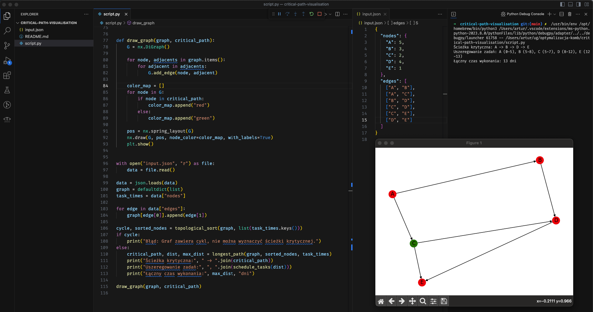

# Critical Path Visualization

Implementation of critical path in Python with visualization

## Screenshot



Critical path is displayed by red nodes.

## Usage

Edit `input.json` file to enter your nodes and edges of the graph.

## How to run

1. Install requirements

```
pip install -r ./requirements.txt
```

2. Run the program

```
python script.py
```
